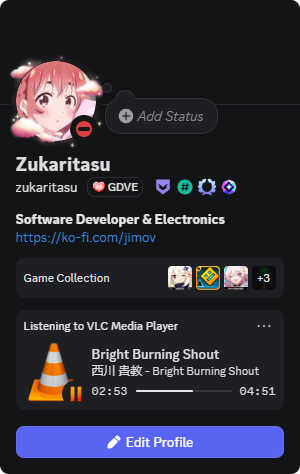
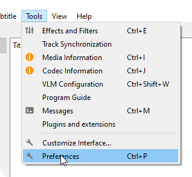
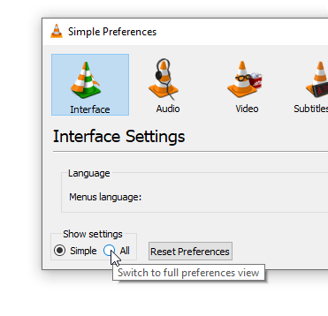
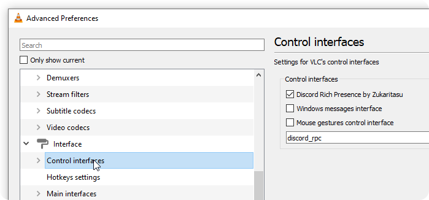

# Discord Rich Presence for VLC Media Player

This is a plugin specifically developed to display the user's activity in VLC on Discord through rich presence. This includes videos, music, images, or any multimedia content supported by VLC.

<p align="center">
  
</p>

# Features

- **Automatic Sync**: Displays title, artist, and album/movie information.
- **Status Support**: Shows if you are Playing, Paused, or Stopped.
- **Time Remaining**: Displays the  current progress time.
- **Enable or disable rich presence**: In the plugin settings (requires restarting VLC)
- **Hide Artist or Album**: In the plugin settings (requires restarting VLC)
- **Custom Discord Application ID**: In the plugin settings (requires restarting VLC)

> [!IMPORTANT]  
> If you don't know how to create a Discord application ID, don't do it, as doing it wrong can cause the plugin to stop working.

# Installation Guide

### Windows

Plugin installation guide for Windows. First, you must update [VLC Media Player](https://www.videolan.org/) to the latest version available to avoid problems. After checking that you have the latest version of VLC, you need to download the latest version of this add-on by clicking here [Latest Release](https://github.com/Zukaritasu/vlc-discordrpc-plugin/releases).

Since the plugin is not part of the VLC compilation, you must copy the downloaded plugin to the misc folder, which is usually located at

```cmd
C:\Program Files\VideoLAN\VLC\plugins\misc
```

Remember that if you have VLC open, you must close it to continue, as you must run the following command in cmd in administrator mode

```cmd
cd "C:\Program Files\VideoLAN\VLC" && vlc --reset-plugins-cache
```

After executing the command, you can open VLC again, but it doesn't end there, as VLC does not load the plugin directly when it opens. You must first enable it in the preferences.

<p align="center">
  
</p>

To show settings, press show all

<p align="center">
  
</p>

Find the menu called Interface and, within it, the submenu called Control interfaces. On the right, you will see the plugin called **Discord Rich Presence**, which you should check. Then, at the bottom, press the save button, restart VLC, and you should now see your presence on **Discord**.

<p align="center">
  
</p>

*If you encounter any errors while installing the plugin, you can leave a comment in the issues tab.*

*If you want to contribute to the development of the plugin, solve a problem, or improve something about how it works, don't forget to make a pull request!*

# Discord Information

* [RPC](https://discord.com:2053/developers/docs/topics/rpc)
* [Example Set Activity Payload](https://discord.com:2053/developers/docs/topics/rpc#setactivity-example-set-activity-payload)
## Technical Details
This plugin communicates with the Discord Client using **Unix Domain Sockets** on Linux/macOS and **Named Pipes** on Windows. It follows the official Discord RPC protocol for "SetActivity".

# Dependencies

- VLC SDK for Windows

# Compatibility

Since the plugin acts as a bridge between VLC Media Player and Discord, related to rich presence, it should be noted that for the plugin to work properly, both programs must be up to date and compatible on the same operating system.

Currently, on Windows, Discord requires a 64-bit operating system to function properly.

| Operating System | Minimum supported version | VLC | Discord | Key details |
|------------------|----------------------------|-----------|---------------|-------------|
| **Windows 7 / 8 / 8.1** | No longer officially supported | ✅ VLC 3.0.x still works | ❌ Discord support ended in March 2024 | Discord only via browser; VLC still runs but without future official support |
| **Windows 10 (32-bit)** | Windows 10 | ✅ VLC supports 32 and 64-bit | ❌ Discord support ended in June 2024 | Discord requires 64-bit; VLC still compiles in 32-bit |
| **Windows 10 (64-bit)** | Windows 10 | ✅ VLC supported | ✅ Discord supported | Recommended minimum option on Windows |
| **Windows 11 (64-bit)** | Windows 11 | ✅ VLC supported | ✅ Discord supported | Best compatibility and long-term support |
| **Linux (64-bit)** | Ubuntu 20.04+, Debian 11+, Fedora 32+, openSUSE 16.2+ | ✅ VLC supported | ✅ Discord supported | Discord does not distribute 32-bit binaries; only web version works on old hardware |
| **macOS** | macOS 11 Big Sur+ | ✅ VLC supported | ✅ Discord supported | Support for Catalina and earlier ended in 2025; only web version works on older macOS |
