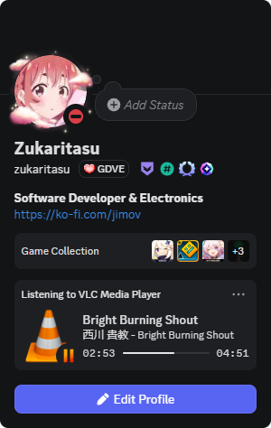

# Discord Rich Presence for VLC Media Player

<p align="center">
  
  
  
  
  
  <br><br>
  
  
  
</p>

This is a plugin specifically developed to display the user's activity in VLC on Discord through rich presence. This includes videos, music, images, or any multimedia content supported by VLC.

<p align="center">
  
</p>

# Features

- **Automatic sync**: Displays title, artist, and album/movie information.
- **Status support**: Shows if you are Playing, Paused, or Stopped.
- **Time remaining**: Displays the  current progress time.
- **Enable or disable rich presence**: In the plugin settings (requires restarting VLC)
- **Enable or disable details or state**: In the plugin settings (requires restarting VLC)
- **Customization of details, status, large text and small text**: In the plugin settings (requires restarting VLC)
- **Show artist or album**: 
- **Custom Discord Application ID**: In the plugin settings (requires restarting VLC)

> [!IMPORTANT]  
> If you don't know how to create a Discord application ID, don't do it, as doing it wrong can cause the plugin to stop working.

## macOS Support

> [!WARNING]
> I do not own a Mac, so the code for this operating system has **not been tested or compiled**. To be realistic, **it is probably broken**.
>
> You will have to fix any compatibility issues and compile it yourself. If you would like to contribute, please feel free to submit a **Pull Request** with the fixes and the compiled binary.

# Installation Guide

### Windows

Just download the installer and run it as administrator; then just hit next, next, and you're done. The installer will automatically activate the plugin so that when you open VLC, the presence starts working right away.

### Linux

Plugin installation guide for Linux. First, you must update [VLC Media Player](https://www.videolan.org/) to the latest version available to avoid problems. After checking that you have the latest version of VLC, you need to download the latest version of this add-on by clicking here [Latest Release](https://github.com/Zukaritasu/vlc-discordrpc-plugin/releases).

Since the plugin is not part of the VLC compilation, you must install the downloaded plugin using the following command:

*before executing the command, make sure VLC is closed*

#### Debian/Ubuntu

```bash
sudo dpkg -i vlc-discordrpc-plugin_1.2.0_amd64.deb
vlcrcedit --install
```

#### Fedora

```bash
sudo dnf install vlc-discordrpc-plugin-1.2.0-1.fc41.x86_64.rpm
vlcrcedit --install
```

# Uninstall

### Windows

To uninstall the plugin, go to Control Panel > Programs and Features, find 'Discord Rich Presence for VLC', and uninstall it.

Path to the uninstaller, in case you want to run it directly without going through the Control Panel
```
C:\Program Files\vlc-discordrpc-plugin\uninstall.exe
```

### Linux (Debian/Ubuntu)
* ```bash
  vlcrcedit --uninstall
  sudo dpkg -r vlc-discordrpc-plugin
  ```

### Fedora
* ```bash
  vlcrcedit --uninstall
  sudo dnf remove vlc-discordrpc-plugin
  ```

# Discord Information

* [RPC](https://discord.com:2053/developers/docs/topics/rpc)
* [Example Set Activity Payload](https://discord.com:2053/developers/docs/topics/rpc#setactivity-example-set-activity-payload)
## Technical Details
This plugin communicates with the Discord Client using **Unix Domain Sockets** on Linux/macOS and **Named Pipes** on Windows. It follows the official Discord RPC protocol for "SetActivity".

# Dependencies

- VLC SDK

# Compatibility

Since the plugin acts as a bridge between VLC Media Player and Discord, related to rich presence, it should be noted that for the plugin to work properly, both programs must be up to date and compatible on the same operating system.

Currently, on Windows, Discord requires a 64-bit operating system to function properly.

| Operating System | Minimum supported version | VLC | Discord | Key details |
|------------------|----------------------------|-----------|---------------|-------------|
| **Windows 7 / 8 / 8.1** | No longer officially supported | ✅ VLC 3.0.x still works | ❌ Discord support ended in March 2024 | Discord only via browser; VLC still runs but without future official support |
| **Windows 10 (32-bit)** | Windows 10 | ✅ VLC supports 32 and 64-bit | ❌ Discord support ended in June 2024 | Discord requires 64-bit; VLC still compiles in 32-bit |
| **Windows 10 (64-bit)** | Windows 10 | ✅ VLC supported | ✅ Discord supported | Recommended minimum option on Windows |
| **Windows 11 (64-bit)** | Windows 11 | ✅ VLC supported | ✅ Discord supported | Best compatibility and long-term support |
| **Linux (64-bit)** | Ubuntu 20.04+, Debian 11+, Fedora 32+, openSUSE 16.2+ | ✅ VLC supported | ✅ Discord supported | Discord does not distribute 32-bit binaries; only web version works on old hardware |
| **macOS** | macOS 11 Big Sur+ | ✅ VLC supported | ✅ Discord supported | Support for Catalina and earlier ended in 2025; only web version works on older macOS |

> [!IMPORTANT]  
> Rich presence no working in your browser, only in the desktop application.